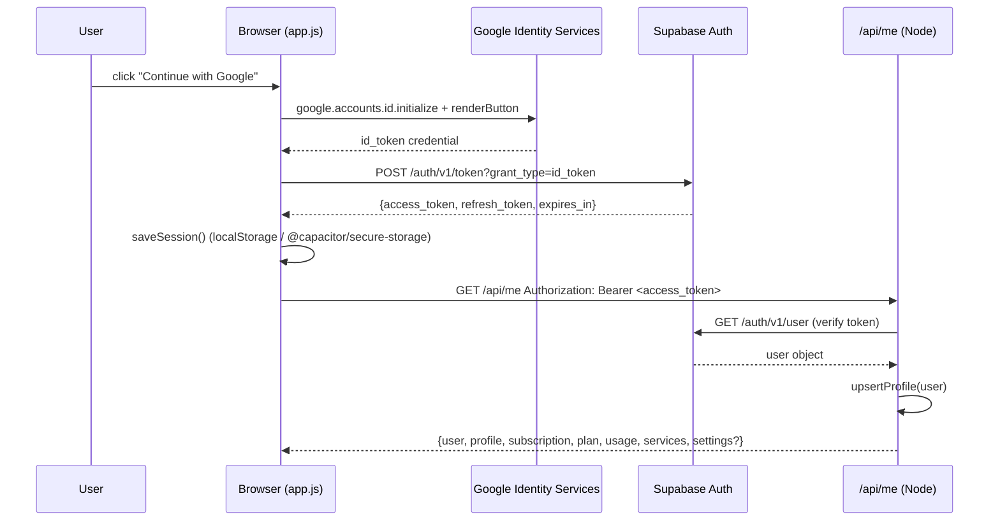
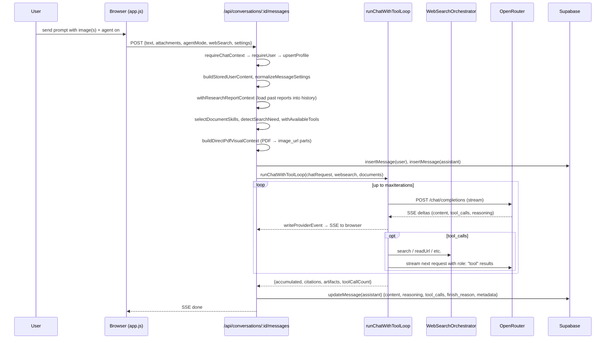
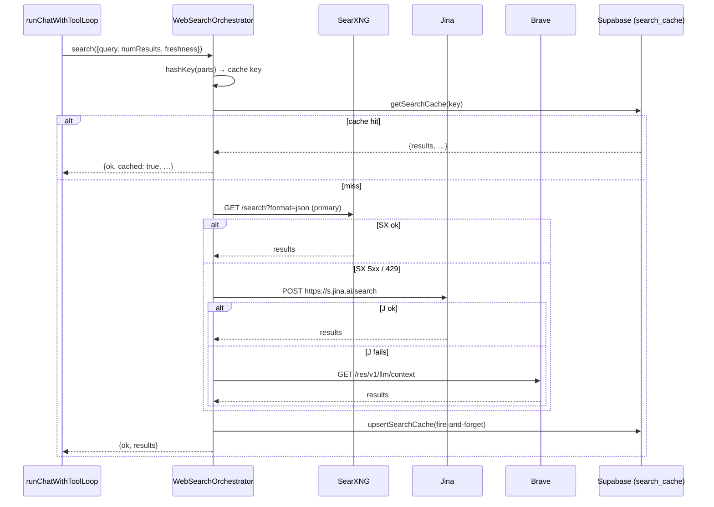
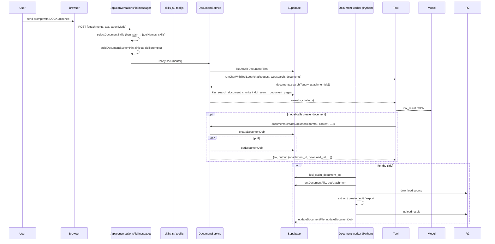
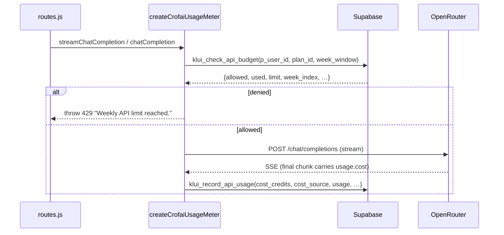

# Klui Chat Architecture (verified against current HEAD)

This document is verified against the working tree after the Phase 1–6
structural refactor (`docs/REFACTORING_RFC.md`). Git history explains
intent but never overrides current behavior — every claim here was
checked against the current source.

## 1. Product and runtime overview

Klui Chat is a Dockerized managed B2C SaaS chat app that sits on top of
a Crof-compatible model API (the same OpenAI-compatible `/chat/completions`
and `/models` surface exposed by both Klui and OpenRouter). The user
experience is a focused single-page web client served from `public/`,
with an Android Capacitor build, a Node server in `server/`, a research
worker process, a Python document worker container, Supabase Postgres +
Auth, Cloudflare R2 object storage, and an internal SearXNG instance for
web search.

The product surface is one branded chat product, with a deliberate,
in-house feature set:

- Supabase Auth sign-in (email magic link by default, Google OAuth when
  `SUPABASE_GOOGLE_ENABLED=true`).
- Supabase Postgres as the system of record: profiles, plans, subscriptions,
  conversations, messages, attachments, document pipeline tables, research
  runs, API-credit usage, payment requests, app settings.
- Cloudflare R2 for private user uploads (images and document files).
- One managed model API key per provider (Klui or OpenRouter), held
  server-side, never sent to the browser.
- Streaming chat with usage metering against a unified weekly API-credit
  budget per plan.
- Compare mode (2–4 models streaming in parallel) and Council mode
  (panel → anonymized peer review → chairman synthesis).
- Web search backed by SearXNG (primary), Jina (`s.jina.ai`) and Brave
  LLM Context (fallbacks), invoked through OpenAI-style tool calls with
  per-plan daily quotas and a two-tier cache.
- Deep Research: long-running Node worker that plans, searches, fetches,
  extracts, and synthesizes a long-form report with citation validation.
- Document skills: PDF/DOCX/XLSX/PPTX/CSV/TSV upload, read, search,
  table extraction, create, edit, export, and visual PDF/Office page images
  for vision-capable models, with a Python document worker
  (`worker/worker.py`) doing the heavy lifting.
- Admin dashboard: plan subscription, system prompt, usage, and Ziina
  payment-request approval.

What is explicitly out of scope (per `README.md`): BYOK, local chat
migration, multi-provider routing, prompt marketplace, OCR, LibreChat
extras.

## 2. Runtime boundaries

```
                    ┌────────────────────────┐
                    │   Browser (PWA / APK)  │
                    │   public/index.html    │
                    │   public/js/*.js       │
                    └──────────┬─────────────┘
                               │ /api/*  (Bearer access_token)
                               │ Bearer = Supabase access token
                               ▼
        ┌──────────────────────────────────────────┐
        │         Node server (server/)            │
        │  index.js  →  routes.js  →  modules       │
        │   http server  │  chat  │  research  │…  │
        └────┬───────────┬───────────────┬─────────┘
             │           │               │
   ┌─────────┘           │               │
   │                     │               │
   ▼                     ▼               ▼
┌────────────┐  ┌────────────────┐  ┌──────────────────┐
│ Crof /     │  │  Supabase      │  │  Cloudflare R2   │
│ OpenRouter │  │  Postgres +    │  │  (signed PUT/GET)│
│ /chat/     │  │  Auth + RLS    │  │  user uploads    │
│ completions│  │                │  │                  │
└────────────┘  └────────────────┘  └──────────────────┘
                       ▲                       ▲
                       │                       │
        ┌──────────────┴────────────┐  ┌────────┴────────────┐
        │ Research worker (Node)    │  │ Document worker      │
        │ server/research/worker.js │  │ worker/worker.py    │
        │ (separate process)        │  │ (separate container) │
        │ claims research_runs rows │  │ claims document_jobs │
        │ via klui_claim_research_  │  │ via klui_claim_     │
        │ run RPC                   │  │ document_job RPC    │
        └───────────────────────────┘  └─────────────────────┘
```

### Boundary contracts

- **Browser ↔ Node** is a `/api/*` JSON surface under a single Bearer
  Supabase access token; the only CORS-tolerant non-API surface is
  `/downloads/android/latest.json` and the APK download directory.
- **Node ↔ research worker** is a Supabase `research_runs` table with
  `klui_claim_research_run` as the atomic claim/leasing RPC. The worker
  writes progress, sources, report, and metadata back into
  `research_runs` and `messages`. There is no in-process queue.
- **Node ↔ document worker** is the same pattern on `document_jobs` and
  `klui_claim_document_job`. The worker downloads the source from R2,
  processes it, uploads the result back to R2, and writes back into
  `document_files` / `document_chunks` / `document_pages` / `document_jobs`.
- **Browser ↔ R2** uses short-lived presigned PUT URLs; the browser is
  expected to upload directly, but `public/js/api.js` falls back to a
  same-origin relay (`PUT /api/uploads/:uploadId/content`) when R2 CORS
  blocks the browser.
- **Browser ↔ Supabase Auth** is a separate direct flow:
  `signInWithIdToken` for Google (web), PKCE for the native APK, and
  email magic link by default. The session token is then reused as the
  API Bearer.

### Process inventory

| Process | Entry | How it runs |
|---|---|---|
| Node web server | `server/index.js` | `npm start` or `node server/index.js` (the Docker image default) |
| Research worker | `server/research/worker.js` | `npm run research:worker` (a separate container in `docker-compose.yml`) |
| Document worker | `worker/worker.py` (Python) | `python -m worker.worker` (the `document-worker` service in `docker-compose.yml`) |
| Internal SearXNG | `searxng/searxng:latest` | the `searxng` service in `docker-compose.yml` |
| Android APK | `android/app/...` | built by `npm run mobile:apk:release` and shipped via `public/downloads/android/` (the download landing page is `public/download/android/index.html`) |

## 3. Module ownership and dependency direction

### Server (`server/`)

| Path | Owns | Depends on |
|---|---|---|
| `server/index.js` | Sole HTTP entry. Dispatches `/api/*` to `routes.js` and everything else to `static.js`. | `./config.js`, `./routes.js`, `./static.js` |
| `server/static.js` | Serves files from `public/`, SPA fallback to `index.html`, the `download/android` flow, and the OTA `latest.json` CORS. | `node:fs`, `node:path`, `./http/cors.js` |
| `server/config.js` | Reads `process.env`, normalizes all numeric/string knobs, exposes the canonical `loadConfig(env)` and `configuredServices(config)` feature flags. | `./crofai/constants.js`, `./saas/plans.js`, `./http/cors.js` |
| `server/providers.js` | Provider registry (`klui`, `openrouter`), per-provider model defaults, `adaptChatRequestForProvider` (rewrites `reasoning_effort` → OpenRouter `reasoning.effort`, pins `require_parameters: true` for tool calls). | `./http/responses.js` |
| `server/crofai/client.js` | OpenAI-compatible HTTP client. Bounded retry/backoff for 408/425/429/5xx, `listModels`, `streamChatCompletion`, `chatCompletion`. The only place that does retry. | `./http/responses.js`, `./providers.js` |
| `server/crofai/constants.js` | Whitelisted Klui base URLs and `normalizeBaseUrl` validator. | `./http/responses.js` |
| `server/crofai/normalize.js` | Validates incoming chat requests: role whitelist, content-type whitelist (text/image_url), image data-URL validator, numeric range checks for `temperature`/`top_p`/`max_tokens`/`seed`, stop and tools validation. | `./http/responses.js` |
| `server/auth/supabase.js` | Bearer-token auth via Supabase `auth/v1/user`, plus `requireSupabaseConfig` and `extractBearerToken`. | `./http/responses.js` |
| `server/db/supabaseRest.js` | PostgREST client for `service_role`. The `SupabaseRest` class keeps the unchanged public surface (`configured`, `request()`, `rpc()`, and every table/RPC method); implementations delegate to `server/db/rest/{profiles,subscriptions,payments,chat,attachments,documents,research,billing,caches,admin,helpers}.js`. **≈297 lines.** | `./http/responses.js`, `./db/rest/*.js` |
| `server/storage/r2.js` | Pure-JS AWS Sig-V4 presigned URL signing for Cloudflare R2, content-type validation, helpers, and the `R2Client` (`presign`, `putObject`, `headObject`, `deleteObject`, `deleteObjects`, `readUrl`). | `node:crypto`, `./http/responses.js` |
| `server/saas/plans.js` | Hard-coded three-tier plan catalog (lite/essential/pro) with env overrides. Pure data. | — |
| `server/saas/entitlements.js` | Resolves the active subscription + plan for a user, short-circuits to the testing plan in `ACCESS_MODE=testing`. | `./http/responses.js`, `./plans.js` |
| `server/saas/billing.js` | Pure billing math: `billingPeriodForSubscription`, `apiUsageWindow` (4-week API-credit window), `usageCostCredits`, `estimateOpenRouterCostCredits`, `fetchOpenRouterGenerationCost` (probes `openrouter.ai/api/v1/generation?id=…`), and `assertApiBudgetAvailable` (calls `klui_check_api_budget`). | `./http/responses.js` |
| `server/saas/usageMeter.js` | Wraps `chatCompletion` and `streamChatCompletion` to enforce weekly budget before the call and record the actual `usage.cost` (or generation cost) afterwards. The single meter for every paid model call. | `./crofai/client.js`, `./billing.js` |
| `server/saas/systemPrompt.js` | Default global system prompt + admin-overridable value stored in `app_settings`. | — |
| `server/saas/models.js` | Vision detection from OpenRouter model descriptors (`input_modalities` plus a name hint regex), and `resolveVisionDescribeModel` (config override → kimi/moonshot scan → `kimi-k2.6`). | — |
| `server/saas/reasoning.js` | Normalizes reasoning deltas from `delta.reasoning_content` (Klui/DeepSeek) and `delta.reasoning` / `delta.reasoning_details[]` (OpenRouter). | — |
| `server/saas/images.js` | Image context for text-only models: collects image attachment ids, substitutes images with text descriptions, calls a vision model once to describe every attached image and returns `{descriptions, model}`. | `./crofai/client.js`, `./http/responses.js`, `./messages.js`, `./models.js` |
| `server/saas/messages.js` | Re-export barrel over `server/saas/messages/{content,stream}.js` (preserves all import paths). `content.js` (~291 lines): title generation, message content normalization, R2 URL hydration, council history filtering, `stripLeakedToolMarkup`. `stream.js` (~191 lines): `applyStreamEvent`, tool-call delta accumulation, SSE serialization, `pipeProviderStreamAndAccumulate`, `streamProviderAndAccumulate`. | `./messages/content.js`, `./messages/stream.js` |
| `server/saas/council.js` | Three-stage council orchestration. `withCouncilSystemPrompt`, `generateNonce`, `buildReviewerAssignments` (shuffled letter labels with nonces to defeat prompt injection), `parseRanking`, `aggregateBordaCount`, `selectChairman`, `runPeerReview` (Stage 2), `buildChairmanPrompt`, `runChairmanSynthesis` (Stage 3). | `node:crypto`, `./crofai/client.js`, `./http/responses.js`, `./messages.js` |
| `server/documents/index.js` | The `DocumentService` orchestrator (~656 lines). Loads documents as soon as text or visual pages are usable, embeds queries with Jina (`embedQuery`), runs similarity search via the `klui_search_document_pages` / `klui_search_document_chunks` RPCs, and implements `search` / `read` / `extractTables` / `createDocument` / `editDocument` / `exportDocument`. Pure helpers live in `server/documents/{inferFormat,resolveContent}.js`. | `./http/responses.js`, `./inferFormat.js`, `./resolveContent.js` |
| `server/documents/skillRegistry.js` | The long prompt strings ("skills") for the model: BASE_SKILLS (`artifact-planner`, `document-read`, `pdf-read`, `document-edit`, `document-export`) and SPECIALIZED_SKILLS (`pdf-create`, `word-create`, `excel-create`, `presentation-create`). | — |
| `server/documents/skills.js` | Heuristic-based tool/skill selection from the user prompt. Returns `{enabled, skills, toolNames, ready}`. | `./skillRegistry.js` |
| `server/documents/tool.js` | The six OpenAI-style tool schemas (`search_document`, `read_document`, `extract_tables`, `create_document`, `edit_document`, `export_document`) and the `executeDocumentToolCall` executor. Emits "pending artifact card" output so the UI can show a "Generating…" card while the worker is still processing. | `./http/responses.js` (implicit via `documents/index.js`) |
| `server/websearch/index.js` | `WebSearchOrchestrator` — provider chain (SearXNG → Jina → Brave) with per-provider circuit breaker, two-tier LRU+Supabase cache via `SearchCache`, and `readUrl` for direct page reads through Jina's `r.jina.ai`. Always-on adult deny list from `deny-domains.js`; `WEBSEARCH_DENY_DOMAINS` is additive. | `./brave.js`, `./cache.js`, `./deny-domains.js`, `./jina.js`, `./searxng.js` |
| `server/websearch/deny-domains.js` | Shared hostname deny list for web search and Deep Research. Built-in adult domains are always enforced; `WEBSEARCH_DENY_DOMAINS` (and any caller-supplied list) is additive via `mergeDenyDomains`. | — |
| `server/websearch/searxng.js` | SearXNG `/search?format=json` caller with a chat-tuned relevance re-ranker (tokenization, stopword filter, host quality bonus, noise blacklist, GitHub-generic filter, "restaurants"-term filter) and a `raw` mode for deep research. | `./jina.js` (for `WebSearchError`) |
| `server/websearch/jina.js` | `jinaSearch` calls `https://s.jina.ai/search` (returns search results + extracted markdown in one call), `jinaRead` calls `https://r.jina.ai/<url>` for a single URL. | `./http/responses.js` |
| `server/websearch/brave.js` | Brave LLM Context API (`https://api.search.brave.com/res/v1/llm/context`) fallback. | `./jina.js` |
| `server/websearch/cache.js` | Two-tier cache: in-process LRU Map + persistent Supabase `search_cache`. | `node:crypto` |
| `server/websearch/detect.js` | Cheap heuristic detector (`detectSearchNeed`) that decides whether to nudge the model toward `web_search` or `read_url`. | — |
| `server/websearch/tool.js` | Re-export barrel over `server/websearch/tool/{loop,visual,unsupported}.js`. `loop.js` (~530 lines) owns `runChatWithToolLoop` (streams the model, intercepts `tool_calls`, reinjects `role: "tool"` results, artifact-handoff guard, empty-answer retry, per-turn iteration cap) and dynamically imports `saas/messages.js` for `streamProviderAndAccumulate`. `visual.js` and `unsupported.js` own the PDF-page pipeline and tools-unsupported degradation. | `./tool/loop.js`, `./tool/visual.js`, `./tool/unsupported.js`, `../documents/tool.js` |
| `server/research/worker.js` | Long-running Node process. Polls `klui_claim_research_run` RPC, runs `runDeepResearch`, writes progress every ~2s via `updateResearchRun`, finalizes the run + the linked assistant message on success/cancel/failure. Heartbeats every `leaseSeconds/2` to keep the lease alive and honour `cancel_requested`. | `node:crypto`, `../config.js`, `../db/supabaseRest.js`, `../saas/entitlements.js`, `../saas/usageMeter.js`, `../providers.js`, `./engine.js` |
| `server/research/engine.js` | The actual research loop. Plan → category classify → for each round: generate queries (cheap model) → SearXNG search → fetch + extract pages (pinned DNS, SSRF guard) → relevance filter → synthesize evolving report → stop-decision (model says YES/NO). Final stage writes the report with the user's selected model. `validateReportLinks` strips/redirects any link not in the allowed sources list. | `./fetcher.js`, `./extract.js`, `./search.js`, `./prompts.js` |
| `server/research/public.js` | Read-time public sanitizer for stored research runs. Filters denied sources, re-validates report/title/summary links against the filtered registry, and is shared by the research HTTP route and chat follow-up context hydration. Does not mutate DB rows. | `./engine.js`, `../websearch/deny-domains.js` |
| `server/research/search.js` | Calls `searxngSearch` once per query, normalizes URLs (strip utm, trailing slash), dedupes across queries, caps each domain at 2 results. | `../websearch/searxng.js` |
| `server/research/fetcher.js` | SSRF-safe HTTP fetcher for research. Resolves DNS, rejects private/loopback addresses, blocks `.local`/`.internal`/metadata hosts, throttles per-host to 350 ms, follows up to 5 redirects, retries 429/503, enforces `maxBytes`. Pure node `http`/`https`, pinned to the resolved address. | `node:dns/promises`, `node:http`, `node:https`, `ipaddr.js` |
| `server/research/extract.js` | Cheerio-based HTML → text extraction. | `cheerio` |
| `server/research/prompts.js` | All research prompts: `planPrompt`, `queryPrompt`, `extractPrompt`, `synthesizePrompt`, `stopPrompt`, `finalReportPrompt` with category-specific guidance (`product` / `comparison` / `howto` / `factcheck`). | — |
| `server/routes.js` | Thin HTTP dispatcher (~233 lines): `handleApiRequest`, `createApiHandler`, CORS preflight, `installStableRequestSignal`, error-to-problem-JSON, and re-exports of chat helpers used by tests. Per-resource handlers live in `server/routes/{context,meta,payments,admin,uploads,research,conversations}.js`. Chat orchestration lives in `server/chat/{pipeline,single,compare,council,temporary,shared}.js`. | `./routes/*.js`, `./chat/*.js`, (handlers pull from the rest of `server/`) |
| `server/http/cors.js` | CORS primitives for the mobile webview. | — |
| `server/http/responses.js` | `class HttpError`, `sendJson`, `sendProblem`, `parseJsonBody`, `readRawBody`. | — |

#### Dependency direction

The arrow of dependency is "inward": `routes.js` and `server/chat/*`
pull from `saas/`, `websearch/`, `documents/`, `storage/`, `db/`,
`auth/`, `providers/`, and `crofai/`. None of those modules import
`routes.js`. The web-search tool loop dynamically imports
`saas/messages.js` from `websearch/tool/loop.js` to break a cycle
(`messages.js` does not import the tool loop). `websearch/tool.js` is
a barrel; `websearch/index.js` exports the orchestrator. `documents/tool.js`
is the document half of the loop; it is the only module that knows the
OpenAI tool schema for documents and the only one that calls
`DocumentService` methods from inside the tool run-loop.

`db/supabaseRest.js` delegates to `db/rest/*` and depends only on
`http/responses.js` plus those modules. `crofai/client.js` and
`storage/r2.js` are also near-leaf modules. The only cross-cutting
shared utilities are `http/responses.js` (errors, JSON, body parsing)
and `config.js` (env loading).

### Browser (`public/js/`)

| Path | Owns |
|---|---|
| `public/index.html` | The whole single-page shell: setup / paywall / chat / research report views, top bar, sidebar, composer, settings, model selector, dialogs. |
| `public/styles.css` | Root stylesheet: 13 `@import` lines over `public/styles/*.css` (must match the approved checksum baseline; verified by `npm run check:css-split` / `scripts/verify-css-split.mjs` against `scripts/css-split-baseline.json`). Tests read the concatenated CSS via `test/helpers/styles.js` `readStylesheet()`. |
| `public/service-worker.js` | Minimal SW for klui.tech PWA only. |
| `public/js/platform/index.js` | The platform abstraction. Detects `Capacitor.isNativePlatform()`. Exposes `apiOrigin()`, `apiUrl()`, `storage`, `preferences`, `signInWithGoogle`, `parseAuthCallbackUrl`, `listenForAuthCallback`, `listenForDeepLinks`, `openExternal`, `download`, `copyText`, `appVersion`, `onResume`, `configureNativeChrome`, `setTextZoom`, `registerBackButton`, `exitApp`. All Capacitor plugins are lazy-loaded so the web build never imports them. |
| `public/js/platform/updates.js` | OTA APK update check: throttled `fetch` to `/downloads/android/latest.json`, versionCode comparison, opens external APK URL. |
| `public/js/api.js` | `apiFetch` wrapper with auto-refresh on 401. All HTTP entry points. `readSseStream` is the SSE reader shared by `streamConversationMessage` and `streamTemporaryChat`. |
| `public/js/auth.js` | Session load/save/clear, `refreshSession`, Google Identity Services loader with iOS-PWA redirect fallback, `signInWithGoogleIdToken`, `renderGoogleSignInButton`, `signOut`, `listenForNativeAuth`. |
| `public/js/pwa.js` | Service worker registration (web only), iOS "Add to Home Screen" hint. |
| `public/js/render.js` | The renderer pipeline. `escapeHtml`, `renderContent` (the public content renderer that walks content parts and produces HTML), `renderRichText` (marked + KaTeX + hljs + DOMPurify), `protectCodeSpans`/`extractMath`/`restoreCodeSpans` (LaTeX isolation that keeps prices like `$1,600` out of math), `highlightCodeBlocks` (per-code-block source storage for the copy button), `getCodeSource`/`resetCodeSourceStore`, `safeImageUrl`, `compactModelDisplayName`, `modelBrandLogoUrl`, `normalizeModelList`, `resolveDefaultCompareModels`, `modelSupportsVision`, `inferModelBadges`, `renderModelOption`/`renderModelDetails`, `formatModelMeta`. |
| `public/js/reasoning.js` | Client mirror of `server/saas/reasoning.js`. Identical signature: `extractReasoningDelta(delta)`. |
| `public/js/app.js` | Composition root (~5,331 lines). Owns `state`, `els`, bootstrap, composer, follow-ups, model catalog, image/document upload pipeline, message rendering shell, settings drawer, theme/appearance, account, conversation sidebar (pinned, search, menu), dialogs, and navigation. Constructs feature factories at boot and calls `stopExtractedModulePollers()` on sign-out/navigation. |
| `public/js/streaming.js` | `createStreamReducer(...)` — client stream reducers (`applyStreamEvent`, `applyToolEvent`, `applyCompareStreamEvent`, `applyCouncilStreamEvent`, `ensureToolState`). Unit-tested via `test/app-reducers.test.js`. |
| `public/js/documentViewer.js` | `createDocumentViewer(...)` — PDF.js viewer, preview-job polling, pending-artifact polling; exposes `stopDocumentPreviewPoll` / `isDocumentPreviewPollActive` and `stopPendingArtifactPolls` / `isPendingArtifactPollsActive`. |
| `public/js/research.js` | `createResearchController(...)` — research card/report rendering and polling; exposes pause, abandon, activity, resume, and update methods including `stopResearchPolling`, `abandonResearchPolling`, and `applyResearchRunUpdate`. |
| `public/js/compare.js` | `createCompareController(...)` — compare mode UI, model picker seeding, `renderCompareMessage`. |
| `public/js/council.js` | `createCouncilController(...)` — council mode UI, `renderCouncilMessage` and progress helpers. |
| `public/js/adminPanel.js` | `createAdminPanel(...)` — admin dashboard load/render/save (admin-only). |

#### Client module dependency direction

```
                        public/js/app.js
                       /    |    |     \
                      /     |    |      \
            api.js   render.js  reasoning.js  platform/index.js
              |                          \
              v                           v
            fetch                   @capacitor/* (lazy)
              |
              v
       /api/* on Node server
```

`app.js` is the single composition root and never the other way around.
Extracted feature modules (`streaming.js`, `documentViewer.js`,
`research.js`, `compare.js`, `council.js`, `adminPanel.js`) receive
explicit capabilities from `app.js` at construction and do not import
back into it. `render.js` is fully self-contained and only depends on
global CDN libraries (`marked`, `katex`, `hljs`, `DOMPurify`).
`platform/index.js` is a leaf module; everything else can import it
but it never imports back. `api.js` does not import `app.js`.
`auth.js` is a pure auth module that can be reused independently.

### Mobile (`android/`, `scripts/mobile/`, `dist-mobile/`)

| Path | Owns |
|---|---|
| `capacitor.config.ts` | Capacitor app config: `appId=tech.klui.app`, `webDir=dist-mobile`, `androidScheme=https`, transparent status bar, splash, keyboard resize. |
| `vite.mobile.config.js` | Vite build config that emits the mobile web bundle into `dist-mobile/`. |
| `scripts/mobile/copy-static.mjs` | Copies `public/` into `dist-mobile/`, re-injects the index.html version tag, and copies `downloads/`. |
| `scripts/mobile/gradle.mjs` | Thin wrapper around `./gradlew` to standardize `assembleDebug` / `assembleRelease`. |
| `scripts/mobile/publish-release.mjs` | Verifies the APK with `apksigner` (checks `KLUI_ANDROID_SHA256`), pulls the manifest, hashes the file, writes `public/downloads/android/klui-<version>.apk` plus `latest.json`. |
| `scripts/mobile/write-asset-links.mjs` | Writes `public/.well-known/assetlinks.json` from `KLUI_ANDROID_SHA256` for Play-style universal links. |
| `android/app/src/main/java/tech/klui/app/MainActivity.java` | Capacitor `BridgeActivity` subclass. Sets edge-to-edge with transparent status/nav bar and disables the Android contrast scrim so the WebView's page background shows through. |
| `android/app/src/main/java/tech/klui/app/TextZoomPlugin.java` | Custom Capacitor plugin that wraps `WebSettings.setTextZoom(int percent)` (clamped 85–130). Exposed to JS as `registerPlugin("TextZoom")` and called by `setTextZoom` in `platform/index.js`. |
| `android/app/src/main/AndroidManifest.xml` | Android manifest with `MainActivity` exported, deep-link `tech.klui.app` scheme, `usesCleartextTraffic` false, status-bar + internet permissions. |
| `dist-mobile/` | The web build artifact. The Android APK loads it from `https://localhost/` (Capacitor's `androidScheme: "https"`). |
| `public/download/android/index.html` | The static download landing page (served when the user navigates to `/download/android`). |
| `public/downloads/android/` | The actual APK binaries (`klui-1.0.0.apk` … `klui-1.0.9.apk`) and `latest.json` consumed by `public/js/platform/updates.js` `checkForAppUpdate` for OTA update prompts. |

The mobile pipeline runs entirely in `package.json` scripts:
`mobile:build` → Vite + `copy-static.mjs`, `mobile:sync` →
`cap sync android`, `mobile:apk:release` → Gradle assembleRelease,
`mobile:release:publish` → `publish-release.mjs`. The Capacitor web
runtime shares the same `public/js/*` modules as the browser client;
the only mobile-specific code is `platform/index.js` (which dispatches
between `localStorage` and `@capacitor/preferences`/`@capacitor/secure-storage`),
`platform/updates.js`, and the Java plugins.

### Document worker (`worker/`)

| Path | Owns |
|---|---|
| `worker/worker.py` | The Python worker entry point. `Processor` polls `klui_claim_document_job`, downloads from R2, and dispatches text extraction, visual enrichment, on-demand page rendering, create, edit, and export jobs. Office visual enrichment converts to a job-local temporary PDF before reusing the PDF renderer; only page JPEGs persist. The `Supabase`/`R2`/`JinaEmbeddings` helper classes live inside this file. |
| `worker/artifact_generator.mjs` | JS fallback for `create_docx`/`create_xlsx`/`create_pptx` (the `docx`, `ExcelJS`, `PptxGenJS` libraries). Called via `node` from the Python worker when `DOCUMENT_USE_JS_ARTIFACT_GENERATOR=1` (the default). |
| `worker/Dockerfile` | Multi-stage build: `node:24-bookworm-slim` for the JS deps, `python:3.12-slim` with `libreoffice`, `poppler-utils`, `qpdf`, and the Python deps. Healthcheck runs `python -m worker.healthcheck`. |
| `worker/requirements.txt` | `boto3`, `charset-normalizer`, `edgeparse`, `openpyxl`, `pypdf`, `python-pptx`, `python-docx`, `reportlab`, `requests`. OCR/Tesseract is intentionally absent. |
| `worker/healthcheck.py` | Verifies EdgeParse plus `soffice`, `pdftotext`, `pdftoppm`, and `qpdf` are present. |

## 4. Data model and external services

The data model lives in `supabase/schema.sql` and the migration files
under `supabase/migrations/`. All tables use `public` schema; only
`document_pages.embedding` lives in the `extensions` schema (the
`pgvector` extension). All RLS is enabled and only `service_role` is
granted `ALL`; authenticated users have `SELECT` policies scoped to
`auth.uid() = user_id` (or `active = true` for `plans`).

### Tables

| Table | Owns | Notes |
|---|---|---|
| `profiles` | `id uuid PK references auth.users`, `email`, `role` (`user`/`admin`), timestamps. | Created on first sign-in by `upsertProfile`. |
| `app_settings` | `key text PK`, `value jsonb`, `updated_by`, timestamps. | Stores the global system prompt as `{"text": "…"}`. RLS read-only for authenticated. |
| `plans` | `id text PK` (`lite` / `essential` / `pro`), `name`, `max_images_per_message`, `price_label`, `active`, `sort_order`. | 3 fixed plans; non-matching `price_label = "Manual payment"`. |
| `subscriptions` | `id`, `user_id`, gateway-neutral columns (`provider`, `provider_customer_id`, `provider_subscription_id`, `provider_price_id`), `plan_id`, `status` (`active`/`trialing`/…), `cancel_at_period_end`, `current_period_end`, `raw jsonb`, timestamps. | Legacy `stripe_*` columns dropped. `provider_subscription_id` is unique. |
| `payment_requests` | `id`, `user_id`, `plan_id`, `amount_aed numeric(10,2)`, `currency`, `provider` (`ziina`), `payment_url`, `qr_image_url`, `reference_code` (unique), `status` (`pending`/`approved`/`rejected`/`cancelled`), `admin_note`, `approved_by`, `approved_at`. | Drives the manual Ziina payment flow. |
| `conversations` | `id`, `user_id`, `title`, `model`, `deleted_at` (soft delete). | Hard-deletes are used; see `deleteConversation` in `server/db/supabaseRest.js`. |
| `messages` | `id`, `user_id`, `conversation_id`, `role` (`system`/`user`/`assistant`/`tool`), `content jsonb` (can be string or parts array), `model`, `reasoning`, `tool_calls jsonb`, `finish_reason`, `error`, `metadata jsonb`, `turn_run_id`, `output_slot`, `created_at`. | `metadata` carries council/websearch/documents/research context. `(turn_run_id, output_slot)` makes resumed document-turn outputs idempotent. |
| `attachments` | `id`, `user_id`, `conversation_id`, `message_id`, `category` (`image`/`document`), `object_key` (unique), `file_name`, `content_type`, `size_bytes`, `etag`, `status` (`pending`/`uploaded`). | Both user uploads and document worker outputs use this table; the R2 object is the actual file. |
| `document_files` | Existing identity/version fields plus `processing_status`, capability timestamps (`text_ready_at`, `visual_ready_at`, `enriched_at`), `stage_errors`, counts, extraction/preview keys, metadata, and terminal error. | `text_ready_at` or `visual_ready_at` makes a document usable; legacy `ready` means all core jobs are terminal, possibly with warnings. |
| `document_chunks` | `id`, `document_file_id`, `user_id`, `chunk_index`, `source_type`, `source_label`, `text`, `char_count`, `token_estimate`, `metadata`, generated `tsv tsvector`. | Unique on `(document_file_id, chunk_index)`. |
| `document_pages` | `id`, `document_file_id`, `user_id`, `page_number`, `source_label`, `image_key`, `image_content_type`, `width_px`, `height_px`, `text`, `char_count`, `token_estimate`, `embedding vector(768)` (`extensions.vector_cosine_ops` HNSW index). | Unique on `(document_file_id, page_number)`. |
| `document_jobs` | `id`, ownership links, `job_type`, status/priority/attempt fields, `worker_id`, `lease_until`, `cancel_requested`, input/output/error, timestamps. | PDF/DOCX/XLSX/PPTX queue independent extract and visual-enrichment jobs; missing requested pages use idempotent priority-100 `document.render_page` jobs. |
| `pending_document_turns` | Durable user turn, normalized request payload, mode, claim token/owner/lease, provider-start fence, cancellation/error/terminal fields. | Reconnect-safe wait and conservative at-most-once provider execution for turns blocked on document capability. |
| `research_runs` | `id`, `user_id`, `conversation_id`, `user_message_id`, `assistant_message_id`, `query`, `model`, `provider` (`openrouter`), `status` (`queued`/`running`/`succeeded`/`failed`/`cancelled`), `phase`, `progress jsonb`, `title`, `summary`, `report_markdown`, `sources jsonb`, `error`, `cancel_requested`, `worker_id`, `lease_until`, `attempt_count`, `elapsed_ms`, timestamps. | Unique partial index on `(user_id) where status in ('queued','running')` — only one active run per user. |
| `usage_api_weekly` | `(user_id, period_start date, week_index 1–4)` PK, `period_end`, `week_start`, `week_end`, `plan_id`, `api_credit_limit numeric(18,8)`, `api_credit_used numeric(18,8)`, `updated_at`. | One row per user per week. |
| `usage_api_events` | `id`, `user_id`, `subscription_id`, `plan_id`, `provider`, `model`, `generation_id`, the same period columns, `cost_credits`, `cost_source` (`openrouter_usage`/`openrouter_generation`/`estimated_tokens`/`missing_usage`/`unknown`), `usage jsonb`, `status`, `created_at`. | Append-only event log. |
| `model_cache` | `id text PK` (base URL), `payload jsonb`, `fetched_at`. | 5 min in-memory + 5 min DB. |
| `search_cache` | `query_hash text PK` (sha256), `query text`, `provider text`, `results jsonb`, `created_at`, `expires_at`. | Two-tier L1/L2 cache backing the web search orchestrator. |

### RPCs

| RPC | Owns |
|---|---|
| `public.klui_check_api_budget(p_user_id, p_plan_id, p_period_start, p_period_end, p_week_start, p_week_end, p_week_index, p_weekly_credit_limit)` | Upserts the current `usage_api_weekly` row and returns `{allowed, api_credit_used, api_credit_limit, …}`. `security definer`. |
| `public.klui_record_api_usage(...)` | Adds the new cost to `usage_api_weekly.api_credit_used` and appends to `usage_api_events`. Returns `{allowed, api_credit_used, api_credit_limit, cost_credits, cost_source, week_index}`. |
| `public.klui_cleanup_storage_and_cache(p_limit, p_grace)` | Batched cleanup of detached terminal `document_jobs`, expired `search_cache`, and stale `model_cache`. R2-backed attachment cleanup runs on the VPS so object keys remain available until storage deletion succeeds. |
| `public.klui_cleanup_orphan_documents(p_limit, p_grace)` | Wrapper for the above (kept for backward compatibility with existing cron callers). |
| `public.klui_claim_document_job(p_worker_id, p_lease_seconds)` | Atomic claim of the next queued or lease-expired job. |
| `public.klui_complete_document_upload(...)` | Atomically completes an upload and queues independent text/visual jobs for PDF and Office formats; CSV/TSV remain text-only. |
| `public.klui_complete_document_job(...)` / `public.klui_fail_document_job(...)` | Lease-fenced, stage-aware worker finalization that preserves any established capability. |
| `public.klui_publish_document_visual_ready(...)` | Publishes visual capability only after the complete page-image manifest exists, before optional Jina completion. |
| `public.klui_queue_document_page_render(...)` | Returns an existing page or creates/requeues one idempotent priority-100 render job. |
| `public.klui_submit_document_turn(...)` and pending-turn claim/heartbeat/start/finish/cancel RPCs | Atomic turn persistence, fenced execution, resume, and cancellation without cascading away uploaded documents. |
| `public.klui_update_pending_turn_output(...)` | Updates a run-linked assistant output only while its claim token and lease are still active. |
| `public.klui_claim_research_run(p_worker_id, p_lease_seconds)` | Atomic claim of the next queued research run. |
| `public.klui_search_document_chunks(p_user_id, p_document_ids, p_query, p_limit)` | Full-text search over `document_chunks.tsv` with RLS-isolated results. |
| `public.klui_search_document_pages(p_user_id, p_document_ids, p_query_embedding, p_limit)` | Vector search over `document_pages.embedding` (cosine, HNSW). |

### External services

| Service | Where it is called |
|---|---|
| Klui model API (`crof.ai/v1`, `crof.ai/v2`) | `server/crofai/client.js` (`listModels`, `streamChatCompletion`, `chatCompletion`). Hard-whitelisted in `server/crofai/constants.js`. |
| OpenRouter (`openrouter.ai/api/v1`) | Same `crofai/client.js` when `provider=openrouter`. Cost reconciliation via `fetchOpenRouterGenerationCost` in `server/saas/billing.js`. |
| Supabase PostgREST (`<project>.supabase.co/rest/v1/*`) | `server/db/supabaseRest.js` — every table read/write. |
| Supabase GoTrue (`<project>.supabase.co/auth/v1/*`) | `server/auth/supabase.js` (`requireUser`); client-side PKCE / magic link / `signInWithIdToken` for Google in `public/js/auth.js`. |
| Cloudflare R2 (S3-compatible at `<accountId>.r2.cloudflarestorage.com`) | `server/storage/r2.js` (presign, putObject, headObject, deleteObject, deleteObjects, readUrl). |
| Jina Search Foundation (`s.jina.ai/search`) | `server/websearch/jina.js` `jinaSearch`. Requires `JINA_API_KEY`. |
| Jina Reader (`r.jina.ai/<url>`) | `server/websearch/jina.js` `jinaRead`. Works anonymously. |
| Jina Embeddings (`api.jina.ai/v1/embeddings`) | `server/documents/index.js` `embedQuery` for document page vector search. |
| Brave Search LLM Context (`api.search.brave.com/res/v1/llm/context`) | `server/websearch/brave.js`. |
| Internal SearXNG (`http://searxng:8080/search?format=json` in compose, `http://localhost:8080/…` standalone) | `server/websearch/searxng.js`; `server/research/search.js` uses `raw: true` mode. |
| Document worker (Python container) | Decoupled through `document_jobs` table. The Node server `enqueueAndWait` inserts a job; the worker `claim`s it; the server polls `GET /api/documents/jobs/:id/status` for the artifact. |
| Research worker (separate Node process) | Decoupled through `research_runs` table. The web tier `POST /api/research` inserts a row; the worker `claim`s it; the web tier polls `GET /api/research/:id/status`. |
| Android deep link (`tech.klui.app://auth/callback`) | `public/js/platform/index.js` `parseAuthCallbackUrl`, `listenForAuthCallback`. |
| Android Play-style universal link (`https://klui.tech/.well-known/assetlinks.json`) | Generated by `scripts/mobile/write-asset-links.mjs`. |

### Migrations

All migrations are listed in `supabase/migrations/`:

- `2026_05_21_add_messages_metadata.sql` — adds `messages.metadata` JSONB
  for the Model Council feature.
- `2026_05_22_add_websearch.sql` — adds `usage_daily.search_count`,
  the `search_cache` table, and the `klui_consume_search` RPC
  (the RPC was later dropped by `2026_06_08_drop_legacy_usage_counters.sql`).
- `2026_05_24_add_document_pages.sql` — adds the `pgvector`
  extension and the `document_pages` table with its
  `vector(768)` embedding column.
- `2026_06_08_add_api_credit_billing.sql` — adds `usage_api_weekly`
  and `usage_api_events`, plus the `klui_check_api_budget` and
  `klui_record_api_usage` RPCs.
- `2026_06_08_add_ziina_payment_requests.sql` — adds the
  `payment_requests` table.
- `2026_06_08_drop_legacy_usage_counters.sql` — drops
  `klui_consume_*` RPCs and the `usage_events` / `usage_monthly` /
  `usage_daily` tables; removes the legacy per-request counters
  from `plans`.
- `2026_06_09_add_pptx_document_support.sql` — extends the
  `document_files.kind` check to include `pptx`.
- `2026_06_10_add_document_cleanup_fk_indexes.sql` — adds the
  partial indexes that make the cleanup query cheap.
- `2026_06_10_add_orphan_document_cleanup.sql` — cascade FKs
  and the `klui_cleanup_orphan_documents` RPC.
- `2026_06_10_extend_cleanup_to_caches.sql` — extends the cleanup
  RPC to also purge `search_cache` and `model_cache`.
- `2026_06_26_add_global_app_settings.sql` — adds the `app_settings`
  table (the global system prompt).
- `2026_06_29_add_research_message_indexes.sql` — adds the
  research-message partial indexes.
- `2026_06_29_add_research_runs.sql` — adds the `research_runs`
  table and the `klui_claim_research_run` RPC.
- `20260712215913_add_office_visual_enrichment.sql` — queues visual
  enrichment for DOCX, XLSX, and PPTX through the existing PDF page path.
- `20260712222116_move_orphan_storage_cleanup_to_vps.sql` — keeps
  R2-backed orphan metadata intact for the idempotent VPS cleanup task.

The current `supabase/schema.sql` is the merged snapshot and
contains the same tables and RPCs as the migration files. The
migration files are kept for documentation and the in-production
PostgREST cache reload.

## 5. Feature map

The features and the modules that implement them:

| Feature | Browser | Server | Persistence / worker |
|---|---|---|---|
| Sign-in (Supabase Auth) | `public/js/auth.js`, `public/js/platform/index.js` (native PKCE) | `server/auth/supabase.js` | Supabase `auth.users`, `profiles` |
| Single chat | `public/js/app.js` `executeSend` → `streamConversationMessage`; reducers in `public/js/streaming.js` | `server/chat/pipeline.js` `handleConversationMessage` (single-chat branch) | `conversations`, `messages`, `attachments` |
| Compare (2–4 models in parallel) | `app.js` + `public/js/compare.js` `renderCompareMessage` | `server/chat/compare.js` `handleCompareConversationMessage` (parallel `streamChatCompletion`) | same tables, one assistant message per model |
| Council (panel → peer review → chairman) | `app.js` + `public/js/council.js` `renderCouncilMessage` | `server/chat/council.js` `handleCouncilConversationMessage` + `server/saas/council.js` | `messages.metadata.council` carries session/role/peer-rank metadata |
| Image upload | `app.js` `addImages` → `uploadImage` in `api.js` | `server/routes/uploads.js` `handlePresignUpload` / `handleUploadContent` / `handleCompleteUpload` | `attachments` (category=`image`), R2 |
| Image description for text-only models | n/a | `server/saas/images.js` `describeConversationImages` | `messages.content[].image_url.description` |
| Document upload | `app.js` `startDocumentUpload` → `uploadFile` in `api.js`; Send unlocks on text or visual capability while enrichment continues silently | `server/routes/uploads.js` `handleCompleteUpload` → `klui_complete_document_upload` (atomic text + visual jobs for PDF/Office) | `attachments`, capability-aware `document_files`, `document_jobs`, document worker |
| Document-gated chat turn | `app.js` persists a client turn key, reconciles existing output slots when resuming after reload, and restores the draft on pre-provider cancel | `server/chat/pipeline.js` submits/claims/heartbeats/executes the persisted turn, exposes its run ID before document polling, fences provider calls and output writes, releases pre-provider disconnects, and finalizes the run before closing SSE | `pending_document_turns`, run-linked message output slots |
| Document read/search/extract/create/edit/export | `app.js` + `public/js/documentViewer.js` (artifact cards, document viewer) | `server/documents/index.js` `DocumentService`, `server/documents/tool.js` `executeDocumentToolCall`, `server/websearch/tool/loop.js` `runChatWithToolLoop` | `document_files`, `document_chunks`, `document_pages`, `document_jobs`, R2 |
| Web search (auto/on/off) | `app.js` `toggleWebSearchMode`, `renderWebSearchToggle`, `webSearchAvailable` | `server/websearch/index.js` `WebSearchOrchestrator`, `server/websearch/tool/loop.js` `runChatWithToolLoop`, `server/chat/pipeline.js` `runSharedPreSearch` | `search_cache`, `usage_api_events` (via tool loop) |
| Deep Research | `app.js` + `public/js/research.js` (`startDeepResearch`, polling, `renderResearchCard`, `renderResearchReport`) | `server/routes/research.js` `handleCreateResearch` / `handleResearchStatus` / `handleCancelResearch` / `handleResearchReport`; `server/research/worker.js`; `server/research/engine.js` | `research_runs`, `messages` (assistant message updated by worker) |
| Temporary chat | `app.js` `setTemporaryChatMode`, `executeSend` `newChat: true` → `streamTemporaryChat` | `server/chat/temporary.js` `handleTemporaryChat` (in-memory only, no persistence, no attachments) | none |
| Plans + payment | `app.js` `renderPlans`, `startZiinaPayment`, `loadPaymentRequests` | `server/routes/payments.js` `handleCreateZiinaPaymentRequest` / `handleListPaymentRequests`; `server/routes/admin.js` `handleAdminPaymentRequests` / `handleAdminUpdatePaymentRequest` | `payment_requests`, `subscriptions`, `plans` |
| Admin dashboard | `app.js` + `public/js/adminPanel.js` | `server/routes/admin.js` `handleAdminSummary` (60s in-process cache) / `handleAdminSettings` | `profiles`, `subscriptions`, `usage_api_weekly`, `payment_requests`, `app_settings` |
| Settings drawer | `app.js` `openSettings` / `closeSettings` / `saveSettings` | n/a (persisted in `localStorage` / `@capacitor/preferences`) | `klui.chat.controls.v1` |
| Update check (native) | `public/js/platform/updates.js` `checkForAppUpdate` | `server/static.js` (serves `public/downloads/android/latest.json` with CORS) | `public/downloads/android/` |
| PWA install | `public/js/pwa.js` | `server/static.js` (serves `manifest.webmanifest`, `service-worker.js`) | n/a |

## 6. Request and data flows

### 6.1 Authentication (web)



Native flow replaces the Google Identity Services step with PKCE:
`public/js/platform/index.js` `signInWithGoogle` calls
`supabase.auth.signInWithOAuth({ provider: "google", options: { redirectTo: "tech.klui.app://auth/callback", skipBrowserRedirect: true } })`,
opens the URL in `@capacitor/browser`, and `listenForAuthCallback`
exchanges the callback `code` for a session on `appUrlOpen`.

### 6.2 Single chat (with agent mode and web search)



### 6.3 Compare and Council

Compare and Council share the same pre-search path. Compare fires
N parallel `streamChatCompletion` requests (one per model), and the
client renders the deltas as a vertical stack. Council runs the same
parallel Stage 1, then `server/saas/council.js` runs the anonymized
peer review (with nonces to defeat prompt injection) and a Borda count
to pick a chairman, who then streams the synthesis. The browser
distinguishes the two via the SSE envelope (`type: "council:start"`,
`type: "council:peer:ballot"`, `type: "council:chairman:start"`, etc.).

### 6.4 Web search



The `readUrl` flow uses `r.jina.ai/<url>` directly. The orchestrator
caches by `hashKey({kind: "read", url})` against the same `search_cache`
table.

### 6.5 Document skills



### 6.6 Deep Research

```mermaid
sequenceDiagram
    participant U as User
    participant B as Browser
    participant API as /api/research
    participant SB as Supabase
    participant W as server/research/worker.js
    participant E as server/research/engine.js
    participant SX as SearXNG
    participant OR as OpenRouter

    U->>B: click "Deep Research"
    B->>API: POST /api/research {query, conversationId?, model}
    API->>SB: listActiveResearchRuns (unique-indexed; 409 if active)
    API->>SB: createConversation (if new)
    API->>SB: insertMessage(user), insertMessage(assistant)
    API->>SB: createResearchRun (queued)
    API-->>B: 202 {run, conversation, userMessage, assistantMessage}
    par poll
        B->>API: GET /api/research/:id/status every ~2s
        API-->>B: {run: {status, phase, progress, …}}
    and worker
        W->>SB: klui_claim_research_run(workerId, leaseSeconds)
        W->>E: runDeepResearch({run, config, callModel, …})
        loop up to maxRounds
            E->>OR: plan / categorize / generate queries
            E->>SX: searchResearchQueries(queries)
            E->>OR: extract page text
            E->>OR: synthesize evolving report
            E->>SB: updateResearchRun({phase, progress, lease_until}) (heartbeat)
            E->>OR: stop decision (YES/NO)
        end
        E->>OR: final report with user's selected model
        E->>SB: updateResearchRun({status: succeeded, title, summary, report_markdown, sources, elapsed_ms})
        W->>SB: updateMessage(assistant, {content, finish_reason, metadata.research})
    end
    B->>API: GET /api/research/:id/report
    API-->>B: {run, report, sources}  (ETag-conditional)
    B->>B: renderResearchReport()
```

### 6.7 Billing and mobile

The Node server uses `createCrofaiUsageMeter` to gate every paid
model call:



For the Android client, the Capacitor WebView loads the same `public/js/*`
modules from `https://localhost/`. The `platform/index.js` abstraction
flips storage between `localStorage` and `@aparajita/capacitor-secure-storage`,
flips session refresh between `supabase-js` (PKCE) and the manual refresh in
`auth.js`, and uses `@capacitor/browser` for OAuth. The
`TextZoomPlugin` exposes `WebSettings.setTextZoom` to the JS
`setTextZoom` helper so the in-app "Text size" slider scales font
glyphs only (no layout reflow).

## 7. Cross-cutting concerns and invariants

- **Server-only secrets.** The Crof/OpenRouter API key, Supabase
  service-role key, R2 access keys, Jina key, Brave key, and
  any `klui_*` token are read in `server/config.js` and never leave
  the Node process. The browser only ever sends a Supabase
  Bearer token and accepts presigned R2 URLs.
- **OpenAI-compatible contract.** Every model call goes through
  `server/crofai/client.js` and the `messages` content shape is
  OpenAI multimodal: `{type: "text"|"image_url"|"file", …}`. The
  `server/crofai/normalize.js` validator is the only allowed entry
  point for chat requests.
- **Usage as the source of truth.** The model reports its own
  `usage.prompt_tokens`, `usage.completion_tokens`, and (where present)
  `usage.cost`. We always pass `stream_options: { include_usage: true }`
  (`server/crofai/client.js`) and prefer `usage.cost` over the local
  OpenRouter fallback pricing. The `cost_source` field in
  `usage_api_events` records the source so we can later reconcile.
- **API-credit weekly window.** The same `usage_api_weekly` row
  blocks the next call. `apiUsageWindow` (`server/saas/billing.js`)
  splits each subscription billing month into four dynamic weeks
  (the actual start/end dates depend on `current_period_end` and
  the subscription's `created_at`).
- **No silent plan switch in testing mode.** `ACCESS_MODE=testing`
  short-circuits the entitlement check to the configured
  `TEST_PLAN_ID` and grants every signed-in user a plan. The
  `subscriptions` table is not used in testing mode.
- **Bounded retry.** `server/crofai/client.js` retries only on
  408/425/429/5xx and exposes `maxAttempts` to callers. Aborts are
  never retried.
- **Provider routing.** The two providers (`klui` and `openrouter`)
  are interchangeable at the `chatCompletion` / `streamChatCompletion`
  level; the only per-provider quirks are normalised in
  `adaptChatRequestForProvider` (`reasoning.effort` shape, `tools` →
  `require_parameters: true`, `usage.include: true` for OpenRouter,
  and `order: ["deepseek"]` for DeepSeek models).
- **R2 signing is pure JS.** No AWS SDK; `server/storage/r2.js`
  implements Sig-V4. The browser is expected to upload directly
  using the presigned URL; when CORS blocks it, the API falls back
  to a same-origin relay at `PUT /api/uploads/:uploadId/content`
  (this is what `public/js/api.js` `putUploadContent` does).
- **Direct-context visual documents.** When a user uploads a PDF or a visually enriched Office document, `buildDirectPdfVisualContext`
  embeds the rendered page images directly as `image_url` parts in
  the request — bypassing the tool loop for visual-capable models,
  and going through a single vision-describe call for text-only
  models in the Compare path.
- **Tool-loop graceful degradation.** `server/websearch/tool/loop.js`
  `runChatWithToolLoop` negotiates providers that don't support
  tools in three steps: keep the request, drop `tool_choice`, drop
  `tools` entirely. The model is always given a chance to produce
  a real answer.
- **Tool-loop artifact handoff guard.** If the model claims a
  document is ready without a real artifact card, the tool loop
  pushes a corrective user message and re-invokes the model.
- **Tool-loop empty-answer retry.** If the model returns an empty
  finish with no tool call, the loop forces a final answer once
  before returning.
- **Council stage filtering.** `filterCouncilHistory` in
  `server/saas/messages.js` drops Stage 1 panelist messages once
  the chairman synthesis succeeded, so follow-up turns see the
  chairman's synthesis instead of N parallel takes.
- **Council nonces.** `buildReviewerAssignments` wraps each panelist
  response in a unique nonce tag and shuffles the letter labels A/B/C/…
  per reviewer to defeat prompt injection through peer-review content.
- **No Postgres access from the browser.** Every read/write goes
  through the Node REST surface, which always uses the service-role
  key. The browser's Supabase client is only used for the auth
  flows.
- **Self-test invariants.** The Node-side test suite asserts:
  `apiUsageWindow` always returns the same 4-week `weekIndex` for
  the same `(subscription, plan, now)` triple; `R2` URLs never
  duplicate the bucket segment when the endpoint already includes
  it; `normalizeUsage` always returns the same shape; the tool loop
  resets provisional prose before the final tool answer; the tool
  loop dedupes inline image fetches across iterations.

## 8. Test strategy

- **Framework**: `node --test` (the `npm test` script). The suite
  collects 20 test files under `test/`.
- **Coverage** (329 tests in the working tree):
  - `test/app-reducers.test.js` — replays `test/fixtures/stream-reducer-fixtures.json`
    through the real reducers imported from `public/js/streaming.js`
    (`createStreamReducer`).
  - `test/artifact-generator.test.js` — artifact generation helpers.
  - `test/chat-sse.test.js` — canonical semantic SSE transcripts for
    single chat with a web-search tool call, compare, council through
    chairman synthesis, temporary chat, error/abort surfacing, retry and
    edit modes, and the billing gate (budget check before / cost record
    after each call).
  - `test/routes-dispatch.test.js` — table-driven `handleApiRequest`
    dispatch: full route inventory, method enforcement, auth boundary
    (503 unconfigured / 401 no token), 404/405/410, problem JSON, CORS
    preflight, and `createApiHandler` seam equivalence.
  - `test/client-auth.test.js` — Supabase auth round-trips.
  - `test/council.test.js` — `buildPeerReviewPrompt`, `parseRanking`, `aggregateBordaCount`, `selectChairman`, `runPeerReview`, `buildChairmanPrompt`.
  - `test/documents.test.js` — `DocumentService` extraction, search, create, edit, export; R2 upload validation; document skill selection.
  - `test/images.test.js` — image description aggregation, normalization, vision describe.
  - `test/mobile.test.js` — Android native chrome, text zoom, secure storage, deep links, OTA updates, Google sign-in (stylesheet assertions via `test/helpers/styles.js`).
  - `test/native-topbar.test.js` — native top-bar mode selection (stylesheet via `readStylesheet()`).
  - `test/normalize.test.js` — provider reasoning effort mapping.
  - `test/providers.test.js` — provider availability, adaptation, model catalog normalization.
  - `test/reasoning.test.js` — `extractReasoningDelta` for both Klui and OpenRouter shapes; reasoning duration metadata.
  - `test/render.test.js` — renderer math/code/math-protection tests; `renderContent` and `modelSupportsVision` and `inferModelBadges`.
  - `test/research.test.js` — research engine budget bounds, source validation, SSRF guard, partial reports, cancel, claim RPC.
  - `test/routes.test.js` — exported helper functions re-exported from `routes.js` (`withResearchReportContext`, `installStableRequestSignal`, `buildDirectPdfVisualContext`, `normalizeAgentMode`, `runSharedPreSearch`, `shouldSuppressWebSearchForDocumentTurn`). It does **not** exercise `handleApiRequest` or any route dispatch; dispatch coverage lives in `test/routes-dispatch.test.js` and the SSE paths in `test/chat-sse.test.js`.
  - `test/saas.test.js` — entitlements, billing, usage meter (open and closed budget), R2 helpers, image counts.
  - `test/supabase-rest.test.js` — stubbed-`fetch` request-shape tests for one representative `SupabaseRest` method per `server/db/rest/*` domain group.
  - `test/usage.test.js` — `normalizeUsage` and `applyStreamEvent` final usage capture.
  - `test/websearch.test.js` — `WebSearchOrchestrator` provider chain, circuit breaker, cache, tool loop, document tool loop integration.
- **Run result** (working tree): 383 tests, 5 suites, **383 pass,
  0 fail, 0 cancelled, 0 skipped**, ~3.4 s wall time.
- **Additional worker tests**: `worker/tests/test_worker_helpers.py` covers
  retry safety, lease renewal filters, bounded concurrency helpers, Jina
  ordering, R2 ETag behavior, and the worker healthcheck. Run with
  `python -m unittest worker.tests.test_worker_helpers` in the worker environment.
- **What is NOT covered by tests**: live Python worker integrations with
  Supabase/R2/Jina/Poppler; the Capacitor Android project; the
  supabase schema migrations (they are SQL files, not tests); the
  Capacitor web build (`scripts/mobile/copy-static.mjs`).
- **End-to-end Android smoke tests**: `.maestro/` holds the Maestro
  UI-test flows (`smoke.yaml`, `native-topbar.yaml`,
  `verify-topbar.yaml`) that boot a freshly built APK and verify
  the top-bar layout, mode chip, and composer behaviors. They run
  through `npm run android:agent-test` (which calls
  `scripts/android-agent-test.sh`) and write screenshots to
  `artifacts/`. These tests require the Maestro CLI plus an
  Android emulator or device; they are not part of `npm test`.

## 9. Architectural hotspots

Phases 1–6 of `docs/REFACTORING_RFC.md` landed the extractions below.
Remaining large files are called out with their pre-refactor
recommendations where still applicable.

| File | Lines | What it owns | Status |
|---|---|---|---|
| `server/routes.js` | 233 | HTTP dispatch, CORS, stable request signal, test re-exports. | **Done (Phase 1).** Handlers in `server/routes/*`; chat in `server/chat/*`. |
| `server/chat/pipeline.js` | 1,186 | `handleConversationMessage` dispatch (single/compare/council, retry/edit), shared pre-search, PDF visual context, tool wiring. | Largest remaining server orchestrator after Phase 1. |
| `server/saas/messages.js` | 2 (barrel) | Re-exports `messages/content.js` (~291) and `messages/stream.js` (~191). | **Done (Phase 4).** |
| `server/websearch/tool.js` | 3 (barrel) | Re-exports `tool/loop.js` (~530), `tool/visual.js`, `tool/unsupported.js`. | **Done (Phase 4).** Dynamic `saas/messages.js` import lives in `loop.js`. |
| `server/documents/index.js` | 656 | `DocumentService` orchestrator; helpers in `inferFormat.js` / `resolveContent.js`. | **Done (Phase 4).** |
| `server/db/supabaseRest.js` | 297 | Thin `SupabaseRest` class delegating to `server/db/rest/*`. | **Done (Phase 2).** |
| `public/js/app.js` | 5,331 | Composition root (bootstrap, composer, sidebar, settings, shell renderers). | **Partial (Phase 3).** Streaming, document viewer, research, compare, council, and admin panel extracted; still the largest client file. |
| `public/styles.css` | 13 | `@import` root over `public/styles/*.css`. | **Done (Phase 6).** Byte-identical split. |
| `server/saas/usageMeter.js` | 174 | Wraps `chatCompletion` / `streamChatCompletion`; budget gate + cost record. | Unchanged per RFC § 10. Optional future split: `costResolver.js` + `usageScanner.js`. |
| `server/research/engine.js` | 336 | `runDeepResearch` loop and private helpers. | Unchanged per RFC § 10. Optional future split: `parseJson.js` + `util.js`. |

### Files that have accumulated high churn

`docs/ARCHITECTURE_HISTORY.md` lists the top-N files by commit count
and explains the timeline.

### Stale or contradictory documentation in the repo

- `README.md` mentions the in-house product name and feature list.
  Its web-search section was stale (Jina-primary / Brave-fallback)
  until the Phase-0 docs pass corrected it to SearXNG-primary; treat
  `server/config.js` and `server/websearch/index.js` as the source of
  truth for provider order.
- `CURRENT_SYSTEM.md` is from May 28 2026 (the post-Stripe-removal
  snapshot) and is marked historical at the top of the file. It is
  stale on web search — it still describes Jina-primary /
  Brave-fallback, while the current code defaults to SearXNG-primary /
  Jina-fallback / Brave-fallback — and it omits `server/research/`,
  `server/documents/`, and `server/providers.js` entirely. The current
  authoritative description of web search is `server/websearch/index.js`
  and `server/research/search.js`.
- `MOBILE.md` is up to date and accurate against the current mobile
  build flow.
- `DOCUMENT_SKILLS_IMPLEMENTATION_PLAN.md` is a planning document;
  it is not authoritative for current behavior. The current
  authoritative description of the document skills is the
  `server/documents/` modules plus `docs/ARCHITECTURE_HISTORY.md`.

## 10. Recommended extraction boundaries

Phases 1–6 of `docs/REFACTORING_RFC.md` implemented items 1–6 and 8
below. What remains is optional follow-up (not scheduled):

1. **`public/js/app.js` further shrink** — Phase 3 extracted streaming,
   document viewer, research, compare, council, and admin panel; the
   composition root is still ~5,331 lines.
2. **`server/chat/pipeline.js`** — the largest post-Phase-1 server file
   (~1,186 lines); could be split along single/compare/council helper
   boundaries if churn increases.
3. **`server/db/supabaseRest.js`** — **done** (delegates to `server/db/rest/*`).
4. **`server/websearch/tool.js`** — **done** (barrel over `tool/*`).
5. **`server/saas/messages.js`** — **done** (barrel over `messages/*`).
6. **`public/styles.css`** — **done** (`@import` split under `public/styles/`).
7. **`server/saas/usageMeter.js`** — deliberately left whole per RFC § 10.
8. **`server/documents/index.js`** — **done** (`inferFormat.js` +
   `resolveContent.js` extracted).
9. **`server/research/engine.js`** — deliberately left whole per RFC § 10.

None of the completed extractions changed the public API or HTTP routes;
they split files along existing internal boundaries.
